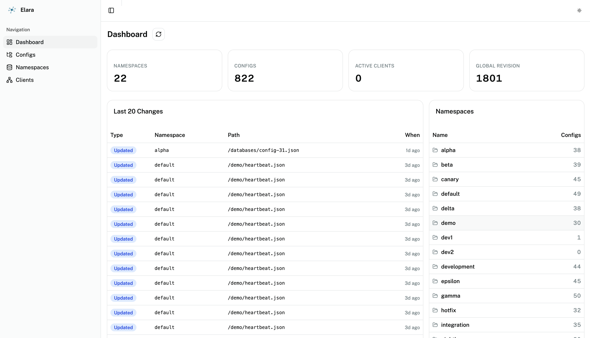

<p align="center">
  
</p>

<h1 align="center">Elara</h1>

<p align="center">
  Configuration management service with a Web UI, a ConnectRPC API, and an etcd-compatible gRPC API.
</p>

<p align="center">
  <a href="https://github.com/sergeyslonimsky/elara/actions/workflows/ci.yml">
    
  </a>
  <a href="https://github.com/sergeyslonimsky/elara/actions/workflows/github-code-scanning/codeql">
    
  </a>
  <a href="https://codecov.io/gh/sergeyslonimsky/elara" >
    
  </a>
  <a href="https://sonarcloud.io/project/overview?id=sergeyslonimsky_elara">
    
  </a>
  <a href="https://github.com/sergeyslonimsky/elara/releases/latest">
    
  </a>
  <a href="https://pkg.go.dev/github.com/sergeyslonimsky/elara">
    
  </a>
  <a href="https://goreportcard.com/report/github.com/sergeyslonimsky/elara">
    
  </a>
  <a href="https://pkg.go.dev/github.com/sergeyslonimsky/elara">
    
  </a>
  <a href="https://github.com/sergeyslonimsky/elara/pkgs/container/elara">
    
  </a>
  <a href="https://artifacthub.io/packages/helm/elara/elara">
    
  </a>
  <a href="LICENSE">
    
  </a>
</p>

Elara stores, edits, and serves application configuration. Operators use the
built-in Web UI for CRUD; services consume values through the same API
surface as etcd (drop-in for any etcd v3 client) or through a typed
ConnectRPC client. A single bbolt file holds all state with ACID
transactions and global revision tracking.

**Status:** early, pre-1.0. Single-instance bbolt today; raft-based HA and
pluggable storage backends (PostgreSQL, S3) are on the roadmap.



## Features

- **Web UI** for browsing, creating, editing, and deleting configs across namespaces.
- **ConnectRPC API** (`elara.config.v1.ConfigService`, `elara.namespace.v1.NamespaceService`, …) — works from Go,
  TypeScript, Python, etc. with native clients.
- **etcd-compatible gRPC API** on port 2379 (`KV`, `Watch`, `Maintenance`, `Cluster`) — connect with `etcdctl` or any
  etcd v3 SDK.
- **Config history** — every version stored, retrievable by revision.
- **Global revision counter** — monotonic, etcd-style semantics.
- **Format-aware validation** for JSON and YAML; pass-through for everything else (ini, toml, plain text).
- **JSON Schema validation** — attach a JSON Schema (draft-07) to a path pattern; every `CreateConfig`/`UpdateConfig`
  call is validated before storage, with structured violation details in the error response.
- **Single bbolt file storage** — ACID transactions, no external DB required.
- **Webhooks** — HTTP push notifications on every config change (create / update / delete). Filter by namespace and path
  prefix, sign payloads with HMAC-SHA256, and inspect per-webhook delivery history from the UI.
- **Observability** — optional Prometheus `/metrics` and OTLP tracing.
- **Kube-native Helm chart** with StatefulSet, ServiceMonitor, NetworkPolicy, JSON Schema validation, and a smoke test.

## Quick start

Run locally with Docker:

```bash
docker run --rm -p 8080:8080 -p 2379:2379 ghcr.io/sergeyslonimsky/elara:latest
```

Open <http://localhost:8080> for the UI. Talk to the etcd-compatible API at
`localhost:2379`. Jump to [Deploying to Kubernetes](#deploying-to-kubernetes)
for the Helm path.

## Usage

### Web UI

The UI (served on the HTTP port, port 8080 by default) covers the full
operator workflow:

- **Dashboard** — cluster-wide KPIs (total namespaces, configs, active
  clients, current global revision) plus the last 20 config changes and a
  per-namespace config count.
- **Configs** — directory-style browser across folders/files, per-namespace.
  Create, edit (format-aware: JSON / YAML / raw), copy, delete, and view
  version history. Every edit bumps the global revision.
- **Namespaces** — CRUD for namespaces (logical grouping of configs).
  Deletion is blocked while the namespace still has configs.
- **Clients** — live list of connected etcd-compatible clients, with
  recent events and basic history.

### etcd-compatible CLI

Any etcd v3 client works. Example with `etcdctl`:

```bash
export ETCDCTL_API=3
export ETCDCTL_ENDPOINTS=localhost:2379

# Write a config (namespace = prefix segment, path = key)
etcdctl put /prod/services/billing/config.yaml "$(cat config.yaml)"

# Read it back
etcdctl get /prod/services/billing/config.yaml

# Watch a prefix for live updates
etcdctl watch --prefix /prod/services/billing/

# Check endpoint health
etcdctl endpoint health
```

### etcd Go client

Keys follow the pattern `/{namespace}/{path}` where `{path}` always starts
with `/`. For example, a config at path `/services/billing/config.yaml` in
the `prod` namespace is stored under the etcd key
`/prod/services/billing/config.yaml`.

**Connect**

```go
import clientv3 "go.etcd.io/etcd/client/v3"

cli, err := clientv3.New(clientv3.Config{
Endpoints:   []string{"localhost:2379"},
DialTimeout: 5 * time.Second,
})
if err != nil {
log.Fatal(err)
}
defer cli.Close()
```

**Get a single config**

```go
resp, err := cli.Get(ctx, "/prod/services/billing/config.yaml")
if err != nil {
log.Fatal(err)
}
if len(resp.Kvs) == 0 {
log.Println("key not found")
} else {
fmt.Printf("value: %s\n", resp.Kvs[0].Value)
}
```

**Get all configs in a namespace (prefix range)**

```go
// clientv3.WithPrefix() expands "/prod/" into the range ["/prod/", "/prod0").
resp, err := cli.Get(ctx, "/prod/", clientv3.WithPrefix())
if err != nil {
log.Fatal(err)
}
for _, kv := range resp.Kvs {
fmt.Printf("%s = %s\n", kv.Key, kv.Value)
}
```

**Watch a single key**

```go
watchCh := cli.Watch(ctx, "/prod/services/billing/config.yaml")
for wresp := range watchCh {
for _, ev := range wresp.Events {
switch ev.Type {
case clientv3.EventTypePut:
fmt.Printf("updated: %s\n", ev.Kv.Value)
case clientv3.EventTypeDelete:
fmt.Println("deleted")
}
}
}
```

**Watch a namespace prefix for any change**

```go
watchCh := cli.Watch(ctx, "/prod/", clientv3.WithPrefix())
for wresp := range watchCh {
for _, ev := range wresp.Events {
fmt.Printf("[%s] %s\n", ev.Type, ev.Kv.Key)
}
}
```

**Watch from a known revision (resumable)**

The `Revision` field on every response header is a global monotonic counter.
Store it between restarts to catch changes that happened while your service
was offline:

```go
// First call: read current configs and capture the revision.
resp, _ := cli.Get(ctx, "/prod/", clientv3.WithPrefix())
startRev := resp.Header.Revision

// On restart: watch from the saved revision so no events are missed.
watchCh := cli.Watch(ctx, "/prod/",
clientv3.WithPrefix(),
clientv3.WithRev(startRev+1),
)
for wresp := range watchCh {
for _, ev := range wresp.Events {
fmt.Printf("[rev %d] [%s] %s\n", ev.Kv.ModRevision, ev.Type, ev.Kv.Key)
}
}
```

**Put / Delete**

```go
// Create or update a config.
_, err = cli.Put(ctx, "/prod/services/billing/config.yaml", `retries: 3`)

// Delete a config.
_, err = cli.Delete(ctx, "/prod/services/billing/config.yaml")
```

### Locked configs and namespaces

Lock is an admin/ops concern, not a data concern. Configs and namespaces can each be locked
independently from the Web UI or the v2 connectrpc admin API; effective lock is true if either
is locked. Locking protects against accidental writes — it does not affect the data itself.

For etcd clients the contract is intentionally narrow:

- **Reads and watches always work.** Locked configs are returned by `Get`/`Range` and appear in
  `Watch` like any other key. The lock state is not surfaced to etcd clients.
- **Writes on locked targets fail with `FailedPrecondition`.** Both `Put` and `DeleteRange` return
  the same uniform message regardless of cause:

  ```text
  Error: etcdserver: put: config "/services/billing/config.yaml" is locked
  ```

  etcd has no concept of namespace, so the message always reads as if the *config* is locked
  even when the parent namespace is the actual cause.
- **Watch streams do not carry lock/unlock events.** This is by design — the etcd channel is a
  clean data plane. Subscribe to `WatchConfigs` on the v2 connectrpc API if you need to react
  to lock state changes.
- **Lock management** (lock/unlock, audit history) is available only via the Web UI and the v2
  connectrpc admin API. There is no etcd-side knob to flip the lock.

Operators can detect clients that keep retrying against locked targets via the
`elara_writes_rejected_total{op,reason,namespace}` Prometheus counter, where `reason` is
`config_locked` or `namespace_locked`.

### JSON Schema validation

Elara can validate config content against a JSON Schema before storing it. Schemas are attached to
path glob patterns (e.g. `/services/**` or `/database.yaml`) and apply across the namespace.

**Web UI**

- **Namespace card → "Schemas"** — manage all schema attachments for a namespace in one place.
  The table shows the pattern, a snippet of the schema, and the attachment date. Use **Attach Schema**
  to add a new one, or the trash icon to remove it.
- **Config page → "Schema" tab** — attach or detach a schema scoped to the exact config path.
  The Monaco editor shows the current schema JSON. The **Live Validation** panel validates the
  config's current content against the schema you're editing in real time (client-side, JSON only).

**Behaviour**

- Schema attachments use glob patterns. When a config is written, the most specific matching pattern
  wins (fewest wildcards); ties are broken by oldest attachment.
- Validation runs after format validation (JSON/YAML must parse first). `FormatOther` files are skipped.
- YAML configs are converted to JSON before validation, so the same schema works for both formats.
- On violation, the API returns `CodeInvalidArgument` with a `SchemaValidationFailure` error detail
  containing each failing path, message, and keyword.

**ConnectRPC** (`elara.config.v1.SchemaService`)

```go
schemaClient := configv1connect.NewSchemaServiceClient(http.DefaultClient, "http://localhost:8080")

// Attach a schema to every YAML file in the "prod" namespace
schemaClient.AttachSchema(ctx, connect.NewRequest(&configv1.AttachSchemaRequest{
Namespace:   "prod",
PathPattern: "/**/*.yaml",
JsonSchema:  `{"type":"object","required":["host"],"properties":{"host":{"type":"string"}}}`,
}))

// Detach
schemaClient.DetachSchema(ctx, connect.NewRequest(&configv1.DetachSchemaRequest{
Namespace:   "prod",
PathPattern: "/**/*.yaml",
}))
```

### Webhooks

Elara sends an HTTP POST to registered webhook endpoints whenever a config is
created, updated, or deleted. Each webhook is managed independently — you can
have multiple endpoints covering different namespaces or path patterns.

**Web UI**

- **Webhooks** page (left nav) — list, create, edit, and delete webhooks.
  Each row shows the target URL, the subscribed events, and a status
  indicator. Click a row to open the delivery history panel and inspect recent
  attempts (status code, latency, error message).

**Payload**

Every delivery is a JSON `POST` with the `Content-Type: application/json` header:

```json
{
  "event": "updated",
  "namespace": "prod",
  "path": "/services/billing/config.yaml",
  "revision": 42,
  "content_hash": "sha256:<hex>",
  "timestamp": "2024-06-01T12:00:00Z"
}
```

`event` is one of `created`, `updated`, `deleted`.

**HMAC-SHA256 signing**

When a webhook has a secret configured, Elara adds an
`X-Elara-Signature: sha256=<hex>` header. Verify it on the receiver side:

```go
mac := hmac.New(sha256.New, []byte(secret))
mac.Write(body)
expected := "sha256=" + hex.EncodeToString(mac.Sum(nil))
if !hmac.Equal([]byte(r.Header.Get("X-Elara-Signature")), []byte(expected)) {
http.Error(w, "invalid signature", http.StatusUnauthorized)
}
```

**Filtering**

| Field              | Behaviour                                                  |
|--------------------|------------------------------------------------------------|
| `namespace_filter` | If set, only events from that namespace are delivered.     |
| `path_prefix`      | If set, only events whose path starts with the prefix.     |
| `events`           | Subset of `created`, `updated`, `deleted` to subscribe to. |

An empty filter means "match everything".

**Retries and delivery history**

Failed deliveries (non-2xx or network error) are retried up to 5 times with
exponential back-off plus cryptographic jitter. Each attempt — success or
failure — is recorded and visible in the UI delivery history panel (last 50
attempts per webhook).

**ConnectRPC** (`elara.webhook.v1.WebhookService`)

```go
import (
webhookv1 "github.com/sergeyslonimsky/elara/gen/elara/webhook/v1"
"github.com/sergeyslonimsky/elara/gen/elara/webhook/v1/webhookv1connect"
)

client := webhookv1connect.NewWebhookServiceClient(
http.DefaultClient,
"http://localhost:8080",
)

// Create a webhook
resp, _ := client.CreateWebhook(ctx, connect.NewRequest(&webhookv1.CreateWebhookRequest{
Url:             "https://my-service.example.com/elara-hook",
Events:          []webhookv1.WebhookEvent{
webhookv1.WebhookEvent_WEBHOOK_EVENT_CREATED,
webhookv1.WebhookEvent_WEBHOOK_EVENT_UPDATED,
},
NamespaceFilter: "prod",       // empty = all namespaces
PathPrefix:      "/services/", // empty = all paths
Secret:          "my-hmac-secret",
Enabled:         true,
}))
fmt.Println("created:", resp.Msg.Webhook.Id)

// List all webhooks
list, _ := client.ListWebhooks(ctx, connect.NewRequest(&webhookv1.ListWebhooksRequest{}))
for _, wh := range list.Msg.Webhooks {
fmt.Printf("%s  %s  enabled=%v\n", wh.Id, wh.Url, wh.Enabled)
}

// Inspect delivery history
history, _ := client.GetDeliveryHistory(ctx, connect.NewRequest(&webhookv1.GetDeliveryHistoryRequest{
WebhookId: resp.Msg.Webhook.Id,
}))
for _, a := range history.Msg.Attempts {
fmt.Printf("attempt %d: status=%d latency=%dms ok=%v\n",
a.AttemptNumber, a.StatusCode, a.LatencyMs, a.Success)
}

// Delete a webhook
client.DeleteWebhook(ctx, connect.NewRequest(&webhookv1.DeleteWebhookRequest{
Id: resp.Msg.Webhook.Id,
}))
```

### ConnectRPC client (Go)

```go
import (
"connectrpc.com/connect"
"net/http"

configv1 "github.com/sergeyslonimsky/elara/gen/elara/config/v1"
"github.com/sergeyslonimsky/elara/gen/elara/config/v1/configv1connect"
)

client := configv1connect.NewConfigServiceClient(
http.DefaultClient,
"http://localhost:8080",
)

resp, _ := client.CreateConfig(ctx, connect.NewRequest(&configv1.CreateConfigRequest{
Namespace: "default",
Path:      "/services/billing/config.yaml",
Content:   []byte("retries: 3\n"),
}))
```

### ConnectRPC client (TypeScript)

```ts
import {createClient} from "@connectrpc/connect";
import {createConnectTransport} from "@connectrpc/connect-web";
import {ConfigService} from "./gen/elara/config/v1/config_service_pb";

const client = createClient(
    ConfigService,
    createConnectTransport({baseUrl: "http://localhost:8080"}),
);

await client.createConfig({
    namespace: "default",
    path: "/services/billing/config.yaml",
    content: new TextEncoder().encode("retries: 3\n"),
});
```

## Deploying to Kubernetes

The chart lives at [`helm/elara/`](helm/elara/) and is designed to be
production-ready by default: StatefulSet with `volumeClaimTemplates`,
non-root security context, JSON-Schema-validated values, optional
ServiceMonitor and NetworkPolicy, and a `helm test` smoke check.

### Install from the Helm repository

Once the GitHub Pages repo is published:

```bash
helm repo add elara https://sergeyslonimsky.github.io/elara
helm repo update

# default: single replica, 2Gi RWO PVC, ClusterIP service
helm install elara elara/elara --namespace elara --create-namespace
```

### Install from a checkout

```bash
helm install elara ./helm/elara --namespace elara --create-namespace
```

### Production values

```yaml
# values-prod.yaml
image:
  digest: sha256:…              # pin by digest, not tag, in prod

resources:
  requests: { cpu: 250m, memory: 256Mi }
  limits: { cpu: "2",  memory: 1Gi }

persistence:
  size: 50Gi
  storageClassName: ssd

ingress:
  enabled: true
  className: nginx
  hosts:
    - host: elara.example.com
      paths: [ { path: /, pathType: Prefix, port: http } ]
  tls:
    - secretName: elara-tls
      hosts: [ elara.example.com ]

metrics:
  enabled: true
  serviceMonitor:
    enabled: true
    labels: { release: kube-prometheus-stack }

tracing:
  enabled: true
  otlpEndpoint: http://otel-collector.observability:4318
```

```bash
helm install elara elara/elara -f values-prod.yaml \
  --namespace elara --create-namespace
```

### Upgrade

```bash
helm upgrade elara elara/elara --namespace elara -f values-prod.yaml
```

Pods restart automatically on ConfigMap changes (via checksum annotation).
`helm.sh/resource-policy: keep` is NOT applied to the PVC, but because the
chart uses `volumeClaimTemplates`, `helm uninstall` leaves the PVC in
place regardless — data survives uninstall.

### Uninstall

```bash
helm uninstall elara --namespace elara

# Optional: drop the PVC too (destroys all stored configs)
kubectl delete pvc data-elara-0 --namespace elara
```

### Exposing the etcd-compatible gRPC port

The chart Ingress exposes only the HTTP / ConnectRPC / UI port (8080).
Port 2379 (etcd gRPC) is reachable cluster-internally over the ClusterIP
service by default. For external exposure, use `service.type: LoadBalancer`
or add a gRPC-aware Ingress — see the [chart
README](helm/elara/README.md#grpc-exposure).

### Invariants

- `replicaCount` is schema-pinned to `1` until raft-based HA is implemented.
  bbolt holds an exclusive file lock — more than one replica corrupts data.
  The schema will relax to `minimum: 1` when raft ships.
- `persistence.accessMode` is pinned to `ReadWriteOnce` for the same reason.
- `storage.type` currently accepts only `bbolt`; the enum will expand with
  future storage backends.

The full values reference, extensibility hooks, and examples live in
[`helm/elara/README.md`](helm/elara/README.md).

## Local development

```bash
make proto       # regenerate protobuf stubs
make test        # go test -race ./...
make lint        # golangci-lint
make format      # golines + gofumpt + gci
go run ./cmd/service
```

The UI is served embedded from `web/dist`; for live reload during frontend
work run `cd web && npm run dev` and hit <http://localhost:3000>.

## Architecture

```
Web UI (React)  ──┐
ConnectRPC client ┤──→  HTTP/2 server (:8080)  ──→  UseCases  ──→  Domain
etcdctl / grpc  ──────→  gRPC server  (:2379)  ──→  UseCases  ──→  Domain
                                                                       │
                                                           Adapter ────┘
                                                           (bbolt)
```

- **Handler** — ConnectRPC / etcd gRPC; proto ↔ domain conversion.
- **UseCase** — application logic; each usecase owns its minimal interface.
- **Domain** — pure entities, validation, errors; no infrastructure imports.
- **Adapter** — bbolt storage and in-memory watch pub/sub.

## Configuration

All config keys flow through Viper; environment variables override every
source. See the
[mapping table in the chart README](helm/elara/README.md#how-configuration-reaches-the-service)
for the full list.

Key defaults:

| Key                  | Env var              | Default  |
|----------------------|----------------------|----------|
| `http.frontend.port` | `HTTP_FRONTEND_PORT` | `8080`   |
| `grpc.etcd.port`     | `GRPC_ETCD_PORT`     | `2379`   |
| `config.data.path`   | `CONFIG_DATA_PATH`   | `./data` |
| `metrics.enabled`    | `METRICS_ENABLED`    | `false`  |
| `tracing.enabled`    | `TRACING_ENABLED`    | `false`  |
| `log.level`          | `LOG_LEVEL`          | `info`   |
| `log.format`         | `LOG_FORMAT`         | `json`   |
| `log.noSource`       | `LOG_NOSOURCE`       | `false`  |

## Contributing

PRs welcome. A few house rules:

- Go: `golines` (120 cols), `gofumpt`, `gci` (stdlib → default → `github.com/sergeyslonimsky/elara` prefix).
- Proto: `make proto` — `buf lint` and `buf breaking` run in CI.
- Tests: `go test -race` must pass.
- Keep changes focused; split unrelated refactors into separate PRs.

## License

[MIT](LICENSE).
