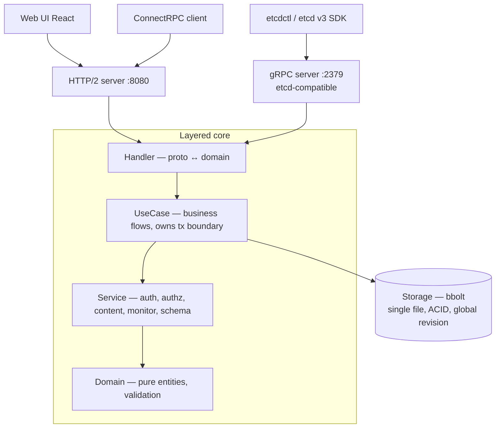

<p align="center">
  
</p>

<h1 align="center">Elara</h1>

<p align="center">
  <strong>etcd-compatible config store for Kubernetes — UI, RBAC, schema validation.</strong>
</p>

<p align="center">
  <a href="https://github.com/sergeyslonimsky/elara/actions/workflows/ci.yml">
    
  </a>
  <a href="https://github.com/sergeyslonimsky/elara/actions/workflows/github-code-scanning/codeql">
    
  </a>
  <a href="https://codecov.io/gh/sergeyslonimsky/elara" >
    
  </a>
  <a href="https://sonarcloud.io/project/overview?id=sergeyslonimsky_elara">
    
  </a>
  <a href="https://github.com/sergeyslonimsky/elara/releases/latest">
    
  </a>
  <a href="https://pkg.go.dev/github.com/sergeyslonimsky/elara">
    
  </a>
  <a href="https://goreportcard.com/report/github.com/sergeyslonimsky/elara">
    
  </a>
  <a href="https://pkg.go.dev/github.com/sergeyslonimsky/elara">
    
  </a>
  <a href="https://github.com/sergeyslonimsky/elara/pkgs/container/elara">
    
  </a>
  <a href="https://artifacthub.io/packages/helm/elara/elara">
    
  </a>
  <a href="LICENSE">
    
  </a>
</p>

Elara is a Kubernetes service that speaks the **etcd v3 wire protocol**, so your
services keep reading config with their existing etcd client — no new SDK. On
top of that store it adds the parts bare etcd leaves out: a full **operator Web
UI**, **JSON Schema validation** per path pattern, groups-based **RBAC**, and a
consumer view that shows **which pod reads which key**. One binary, one
[bbolt](https://github.com/etcd-io/bbolt) file, no cluster to run.

- **Drop-in for etcd v3 clients** — point `etcdctl` or any etcd SDK at port 2379.
- **Guardrails before storage** — invalid config is rejected by JSON Schema, not
  discovered at runtime.
- **Operator-friendly** — browse, edit, diff, and audit config from a UI, with
  Casbin RBAC scoped by namespace.


## Quickstart

Elara ships a `demo` build that seeds sample namespaces, keys, JSON Schemas, and
simulated Kubernetes pod consumers so the UI has something to explore
immediately. Build it and run it:

```bash
docker build --build-arg DEMO_MODE=true -t elara:demo .
docker run --rm -p 8080:8080 -p 2379:2379 elara:demo
```

Open <http://localhost:8080> — the UI loads pre-populated with three namespaces
(`production`, `staging`, `dev`), ~10 keys, and simulated k8s consumers reading
them. Try editing `production/api/limits.json` to a bad value to watch schema
validation reject the write. The etcd-compatible API is live at `localhost:2379`
at the same time.

For a guided 5-minute tour see the [Quickstart guide](docs/quickstart.md); for a
worked example with three services reading config live, follow the
[todo-app tutorial](docs/tutorial-todo-app.md).

### Deploy to Kubernetes

```bash
helm repo add elara https://sergeyslonimsky.github.io/elara
helm install elara elara/elara
```

See the [Helm chart docs](helm/elara/README.md) for prerequisites, `values.yaml`
reference, and production configuration (ingress, persistence, resource limits).

### Run locally without Docker

Every [release](https://github.com/sergeyslonimsky/elara/releases) publishes
prebuilt binaries for macOS and Linux (amd64/arm64). Download the archive for
your platform, extract it, and run:

```bash
./elara
```

With no config at all, it stores its bbolt state at `~/.elara/data/elara.db`
and auto-loads `~/.elara/config.yaml` if you create one — see the
[Configuration docs](docs/configuration.md) for the full reference and every
env var.

## Why Elara

Three things Elara gives you that a bare etcd cluster does not:

1. **etcd v3 drop-in.** Elara serves the etcd v3 gRPC API (`KV`, `Watch`,
   `Maintenance`, `Cluster`) on port 2379. Existing clients connect unchanged —
   `Put`, `Get`, `Watch`, prefix ranges, and resumable watches from a stored
   revision all work as they do against real etcd.

   ```bash
   export ETCDCTL_API=3 ETCDCTL_ENDPOINTS=localhost:2379
   etcdctl put /prod/services/billing/config.yaml "$(cat config.yaml)"
   etcdctl watch --prefix /prod/services/billing/
   ```

2. **JSON Schema validation per path pattern.** Attach a JSON Schema (draft-07)
   to a glob pattern such as `/services/**` or `/**/*.yaml`. Every write is
   validated before it is stored; on failure the API returns the exact failing
   path, message, and schema keyword, and the stored config is untouched. The
   most specific matching pattern wins.

3. **k8s-aware client observability.** The Clients view shows each connected
   etcd consumer with its Kubernetes namespace, pod, and node, plus which key it
   is watching and at which revision — so you can see exactly which workloads
   depend on a config before you change it.

## When NOT to use Elara

Elara is deliberately scoped. Reach for something else if you need:

- **Percentage rollouts / A/B testing** → use [Unleash](https://www.getunleash.io/)
  or [GrowthBook](https://www.growthbook.io/).
- **Service discovery / service mesh** → use [Consul](https://www.consul.io/) or
  [linkerd](https://linkerd.io/).
- **A 99.99% HA guarantee today** → run a bare [etcd](https://etcd.io/) cluster.
  Elara is single-instance for now (see [Roadmap](#roadmap)).
- **Secrets with automatic rotation** → use [Vault](https://www.vaultproject.io/).

## Elara vs. bare etcd

Elara keeps etcd's wire protocol and revision semantics, then adds the operator
plane on top:

| Feature                 | bare etcd     | **Elara**                                  |
|-------------------------|---------------|--------------------------------------------|
| etcd v3 wire            | yes           | **yes (drop-in)**                          |
| Web UI                  | —             | **full operator UI**                       |
| Schema validation       | —             | **JSON Schema per path pattern**           |
| RBAC                    | role-based    | **Casbin groups + namespace domains**      |
| GitOps bundle           | —             | **YAML/JSON export/import round-trip**     |
| Per-key consumer view   | —             | **k8s-aware (namespace / pod / node)**     |
| Config history          | revision only | **full version history + side-by-side diff** |

**Single-instance, on purpose.** One binary, one bbolt file, one backup command
— no cluster to operate, no quorum to reason about. The trade-off is that Elara
is not yet highly available: bbolt holds an exclusive file lock, so exactly one
instance runs at a time. If you need HA today, use a bare etcd cluster; if you
want a simple, auditable config plane you can back up with `cp`, this is the
trade Elara makes.

## Architecture

Three client surfaces — the React Web UI, typed ConnectRPC clients, and any
etcd v3 client — converge on one layered core and one bbolt store.


```mermaid
flowchart TB
    ui[Web UI React] --> http
    rpc[ConnectRPC client] --> http
    etcd[etcdctl / etcd v3 SDK] --> grpc

    http["HTTP/2 server :8080"]
    grpc["gRPC server :2379<br/>etcd-compatible"]

    http --> handler
    grpc --> handler

    subgraph core[Layered core]
        direction TB
        handler[Handler — proto ↔ domain]
        usecase[UseCase — business flows, owns tx boundary]
        service[Service — auth, authz, content, monitor, schema]
        domain[Domain — pure entities, validation]
    end

    handler --> usecase
    usecase --> service
    usecase --> storage
    service --> domain

    storage[(Storage — bbolt<br/>single file, ACID, global revision)]
```

The full diagram, layer table, and ports live in
[docs/architecture.md](docs/architecture.md). Two architecture decision records
capture the non-obvious choices:

- [ADR 0001 — Usecase-owned transactions with context-injected tx handles](docs/adr/0001-usecase-owned-transactions.md)
- [ADR 0002 — Groups-only RBAC](docs/adr/0002-groups-only-rbac.md)

## Roadmap

Elara is **early and pre-1.0**. The store, etcd-compatible API, Web UI, schema
validation, RBAC, webhooks, and Helm chart are working today; the API and
on-disk format may still change before 1.0. The headline gap is high
availability: Elara runs as a single instance because bbolt holds an exclusive
file lock. Raft-based HA and pluggable storage backends (PostgreSQL, S3) are the
main direction after 1.0. HA is intentionally left out of the comparison table
above until it ships.

## Contributing

Contributions are welcome — see [CONTRIBUTING.md](CONTRIBUTING.md) for the dev
setup, test commands, and conventions. Security issues should be reported
privately per [SECURITY.md](SECURITY.md), not as public issues.

## License

[MIT](LICENSE).
