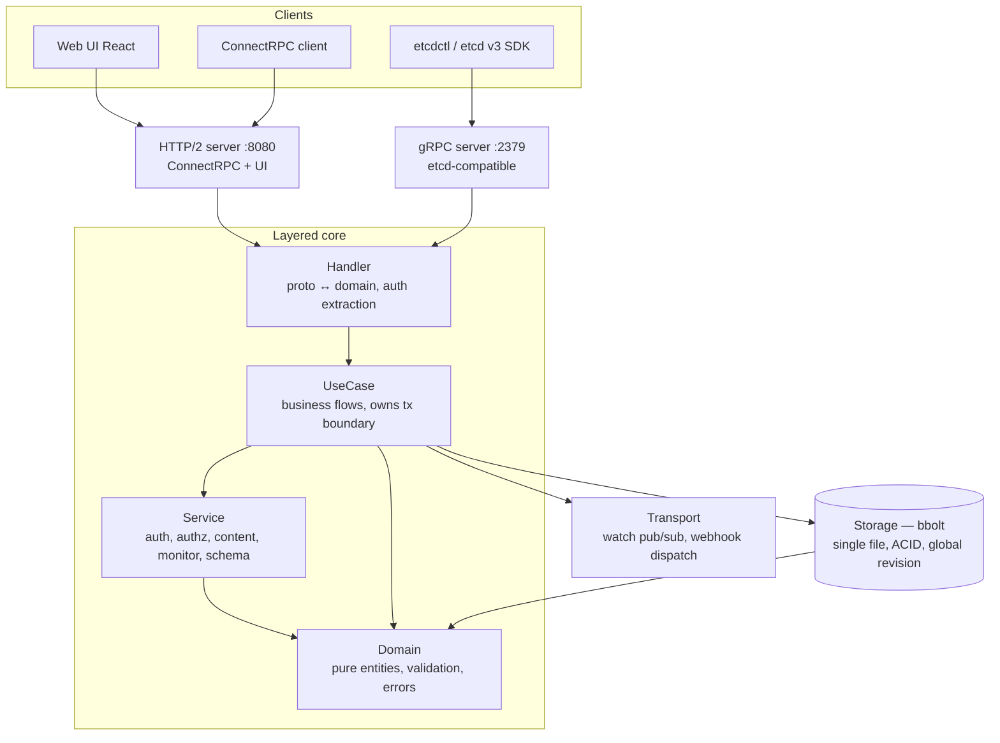

# Architecture

Elara is a single Go binary backed by one [bbolt](https://github.com/etcd-io/bbolt)
file. Three client surfaces — the React Web UI, typed ConnectRPC clients, and
any etcd v3 client — all converge on the same layered core and the same store.

## Request flow

## Layers

Dependencies point downward; the domain layer imports no infrastructure.

| Layer | Package path | Responsibility |
|-------|--------------|----------------|
| **Handler** | `internal/handler/v2/` (ConnectRPC), `internal/handler/etcdv3/` | Proto ↔ domain conversion; auth-detail extraction via `authctx`. No business logic. |
| **UseCase** | `internal/usecase/*/` | Business flows; owns transaction boundaries via `storage.Manager.WithTx(ctx, fn)`; orchestrates services and repos. |
| **Service** | `internal/service/{auth,authz,content,monitor,schemavalidator}` | Infrastructure encapsulation (OIDC, Casbin, password, sessions, dispatching). Backend-agnostic — does not import `storage/bbolt`. |
| **Storage** | `internal/storage/` (Manager interface) + `internal/storage/bbolt/` (impl) | Backend-agnostic `storage.Manager.WithTx` + bbolt-backed repos, one file per entity. |
| **Domain** | `internal/domain/` | Pure entities, validation, errors; zero infrastructure imports. |
| **Transport** | `internal/transport/{grpc,watch,webhook}` | Wire transports orthogonal to the request/response path — etcd gRPC server, watch pub/sub, webhook dispatch. |

Wiring lives in `internal/di/`; the entry point is
`cmd/service/main.go` → `di.LoadContainer` → `service.NewServiceManager`.

## Ports and state

| Port   | Surface                                                    |
|--------|------------------------------------------------------------|
| `8080` | HTTP/2: Web UI, ConnectRPC API                             |
| `2379` | etcd-compatible gRPC API (`KV`, `Watch`, `Maintenance`, `Cluster`) |

All state lives in a single bbolt file (`./data/elara.db` by default) with ACID
transactions and a monotonic, etcd-style global revision counter. Only one
instance can run at a time — bbolt holds an exclusive file lock, which is why
the Helm chart pins `replicaCount` to `1` until raft-based HA lands.

## Design decisions

Two architecture decision records capture the non-obvious choices behind this
layering:

- [ADR 0001 — Usecase-owned transactions with context-injected tx handles](adr/0001-usecase-owned-transactions.md):
  why the **usecase** owns the transaction boundary and the `*bolt.Tx` travels
  implicitly through `context.Context`, keeping repo and service signatures
  free of a `tx` parameter while still making multi-step writes atomic.
- [ADR 0002 — Groups-only RBAC: users get permissions solely through group membership](adr/0002-groups-only-rbac.md):
  why there is no API to grant a role directly to a user, and how Casbin's
  recursive role resolution makes group membership the single, auditable lever
  for access.
