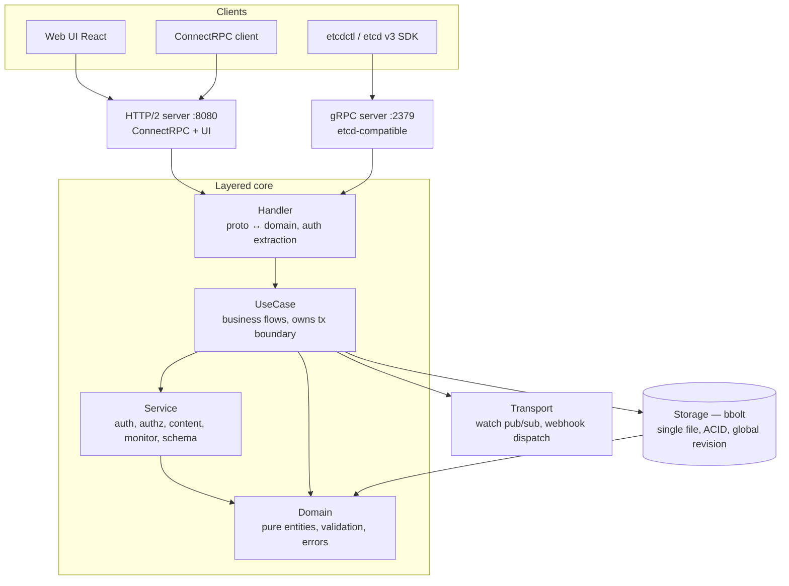

# Architecture

Elara is a single Go binary backed by one [bbolt](https://github.com/etcd-io/bbolt)
file. Three client surfaces — the React Web UI, typed ConnectRPC clients, and
any etcd v3 client — all converge on the same layered core and the same store.

## Request flow

```mermaid
flowchart TB
    subgraph clients[Clients]
        ui[Web UI React]
        rpc[ConnectRPC client]
        etcd[etcdctl / etcd v3 SDK]
    end

    http["HTTP/2 server :8080<br/>ConnectRPC + UI"]
    grpc["gRPC server :2379<br/>etcd-compatible"]

    ui --> http
    rpc --> http
    etcd --> grpc

    subgraph core[Layered core]
        direction TB
        handler[Handler<br/>proto ↔ domain, auth extraction]
        usecase[UseCase<br/>business flows, owns tx boundary]
        service[Service<br/>auth, authz, content, monitor, schema]
        domain[Domain<br/>pure entities, validation, errors]
    end

    http --> handler
    grpc --> handler
    handler --> usecase
    usecase --> service
    usecase --> storage
    service --> domain
    usecase --> domain

    storage[(Storage — bbolt<br/>single file, ACID, global revision)]
    transport[Transport<br/>watch pub/sub, webhook dispatch]

    usecase --> transport
    storage --> domain
```

## Layers

Dependencies point downward; the domain layer imports no infrastructure.

| Layer | Package path | Responsibility |
|-------|--------------|----------------|
| **Handler** | `internal/handler/v2/` (ConnectRPC), `internal/handler/etcdv3/` | Proto ↔ domain conversion; auth-detail extraction via `authctx`. No business logic. |
| **UseCase** | `internal/usecase/*/` | Business flows; owns transaction boundaries via `storage.Manager.WithTx(ctx, fn)`; orchestrates services and repos. |
| **Service** | `internal/service/{auth,authz,content,monitor,schemavalidator}` | Infrastructure encapsulation (OIDC, Casbin, password, sessions, dispatching). Backend-agnostic — does not import `storage/bbolt`. |
| **Storage** | `internal/storage/` (Manager interface) + `internal/storage/bbolt/` (impl) | Backend-agnostic `storage.Manager.WithTx` + bbolt-backed repos, one file per entity. |
| **Domain** | `internal/domain/` | Pure entities, validation, errors; zero infrastructure imports. |
| **Transport** | `internal/transport/{grpc,watch,webhook}` | Wire transports orthogonal to the request/response path — etcd gRPC server, watch pub/sub, webhook dispatch. |

Wiring lives in `internal/di/`; the entry point is
`cmd/service/main.go` → `di.LoadContainer` → `service.NewServiceManager`.

### Which layer gets a new responsibility

The table says what each layer owns; it does not say how to place something new.
The rule is in [ADR 0003](adr/0003-responsibility-placement.md): a
responsibility belongs to the layer whose concerns it depends on. The handler
owns what depends on *how the call arrived* — wire format, authentication,
authorizing the caller, resolving who is calling. The usecase owns what depends
on *what the caller wants* — the flow, the transaction boundary, the ordering of
side effects against the commit. A service does one concrete job and knows
nothing about the business case that invoked it.

The test: move the code to a different transport. If it must come along
unchanged it is a usecase concern; if it only makes sense for that transport it
is a handler concern.

Two consequences that are easy to get wrong:

- **Watch and webhook notifications are published by the usecase.**
  `internal/transport/{watch,webhook}` holds the publisher and the dispatcher,
  but the usecase calls them — see
  `internal/usecase/config/service_create.go` and its siblings. An event must
  not be published before its transaction commits, which is why publication is
  ordered by whoever owns the boundary.
- **Authorizing the caller is a handler concern**, because the mechanism depends
  on the transport: ConnectRPC authorizes in `internal/handler/v2/interceptor`
  over session identity, while the etcd-compatible API authorizes in
  `internal/handler/etcdv3/access.go` over service-token claims. `pdp.Effective*`
  calls inside a usecase are *scoping* — which namespaces a principal may see —
  not permission checks.

Both handler packages follow this today. `internal/handler/etcdv3` used to
orchestrate `Txn` and publish its own watch events; that moved into
`internal/usecase/config` when `Txn` was made atomic, which could not be done
without it — a transaction boundary cannot be placed around orchestration that
lives in a handler.

## Ports and state

| Port   | Surface                                                    |
|--------|------------------------------------------------------------|
| `8080` | HTTP/2: Web UI, ConnectRPC API                             |
| `2379` | etcd-compatible gRPC API (`KV`, `Watch`, `Maintenance`, `Cluster`) |

All state lives in a single bbolt file (`~/.elara/data/elara.db` by default;
`/var/lib/elara/elara.db` in the container image) with ACID
transactions and a monotonic, etcd-style global revision counter. Only one
instance can run at a time — bbolt holds an exclusive file lock, which is why
the Helm chart pins `replicaCount` to `1` until raft-based HA lands.

## Design decisions

Three architecture decision records capture the non-obvious choices behind this
layering:

- [ADR 0001 — Usecase-owned transactions with context-injected tx handles](adr/0001-usecase-owned-transactions.md):
  why the **usecase** owns the transaction boundary and the `*bolt.Tx` travels
  implicitly through `context.Context`, keeping repo and service signatures
  free of a `tx` parameter while still making multi-step writes atomic.
- [ADR 0002 — Groups-only RBAC: users get permissions solely through group membership](adr/0002-groups-only-rbac.md):
  why there is no API to grant a role directly to a user, and how Casbin's
  recursive role resolution makes group membership the single, auditable lever
  for access.
- [ADR 0003 — Where a responsibility goes: the layer is decided by what the code depends on](adr/0003-responsibility-placement.md):
  the rule for placing something new, the transport test that applies it, and
  why notification is a usecase concern while authorizing the caller is not.
