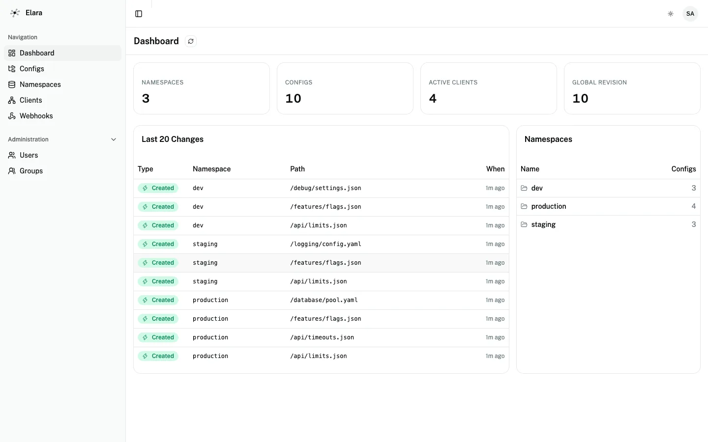

<!--
  This page mirrors the repository README.md (EL-53 M1.1), adapted for MkDocs:
  repo-root file links (LICENSE, CONTRIBUTING.md, SECURITY.md) point at absolute
  GitHub URLs, in-docs links stay relative (quickstart.md, architecture.md,
  adr/…); the repo-root logo (logo.svg) is omitted so the MkDocs build stays
  clean, but the dashboard screenshot lives under docs/assets/ and is included
  below with a relative path.
-->

# Elara

**etcd-compatible config store for Kubernetes — UI, RBAC, schema validation.**

[](https://github.com/sergeyslonimsky/elara/actions/workflows/ci.yml)
[](https://github.com/sergeyslonimsky/elara/releases/latest)
[](https://goreportcard.com/report/github.com/sergeyslonimsky/elara)
[](https://github.com/sergeyslonimsky/elara/blob/master/LICENSE)

Elara is a Kubernetes service that speaks the **etcd v3 wire protocol**, so your
services keep reading config with their existing etcd client — no new SDK. On
top of that store it adds the parts bare etcd leaves out: a full **operator Web
UI**, **JSON Schema validation** per path pattern, groups-based **RBAC**, and a
consumer view that shows **which pod reads which key**. One binary, one
[bbolt](https://github.com/etcd-io/bbolt) file, no cluster to run.

- **Drop-in for etcd v3 clients** — point `etcdctl` or any etcd SDK at port 2379.
- **Guardrails before storage** — invalid config is rejected by JSON Schema, not
  discovered at runtime.
- **Operator-friendly** — browse, edit, diff, and audit config from a UI, with
  Casbin RBAC scoped by namespace.



New here? Start with the [Quickstart](quickstart.md), then read the
[Architecture](architecture.md) overview.

## Quickstart

Elara ships a `demo` build that seeds sample namespaces, keys, JSON Schemas, and
simulated Kubernetes pod consumers so the UI has something to explore
immediately. Build it and run it:

```bash
docker build --build-arg DEMO_MODE=true -t elara:demo .
docker run --rm -p 8080:8080 -p 2379:2379 elara:demo
```

Open <http://localhost:8080> — the UI loads pre-populated with three namespaces
(`production`, `staging`, `dev`), ~10 keys, and simulated k8s consumers reading
them. Try editing `production/api/limits.json` to a bad value to watch schema
validation reject the write. The etcd-compatible API is live at `localhost:2379`
at the same time.

See the [Quickstart guide](quickstart.md) for a guided 5-minute tour, or the
[todo-app tutorial](tutorial-todo-app.md) for a worked example with three
services reading config live.

## Why Elara

Three things Elara gives you that a bare etcd cluster does not:

1. **etcd v3 drop-in.** Elara serves the etcd v3 gRPC API (`KV`, `Watch`,
   `Maintenance`, `Cluster`) on port 2379. Existing clients connect unchanged —
   `Put`, `Get`, `Watch`, prefix ranges, and resumable watches from a stored
   revision all work as they do against real etcd.

   ```bash
   export ETCDCTL_API=3 ETCDCTL_ENDPOINTS=localhost:2379
   etcdctl put /prod/services/billing/config.yaml "$(cat config.yaml)"
   etcdctl watch --prefix /prod/services/billing/
   ```

2. **JSON Schema validation per path pattern.** Attach a JSON Schema (draft-07)
   to a glob pattern such as `/services/**` or `/**/*.yaml`. Every write is
   validated before it is stored; on failure the API returns the exact failing
   path, message, and schema keyword, and the stored config is untouched. The
   most specific matching pattern wins.

3. **k8s-aware client observability.** The Clients view shows each connected
   etcd consumer with its Kubernetes namespace, pod, and node, plus which key it
   is watching and at which revision — so you can see exactly which workloads
   depend on a config before you change it.

## When NOT to use Elara

Elara is deliberately scoped. Reach for something else if you need:

- **Percentage rollouts / A/B testing** → use [Unleash](https://www.getunleash.io/)
  or [GrowthBook](https://www.growthbook.io/).
- **Service discovery / service mesh** → use [Consul](https://www.consul.io/) or
  [linkerd](https://linkerd.io/).
- **A 99.99% HA guarantee today** → run a bare [etcd](https://etcd.io/) cluster.
  Elara is single-instance for now (see [Roadmap](#roadmap)).
- **Secrets with automatic rotation** → use [Vault](https://www.vaultproject.io/).

## Elara vs. bare etcd

Elara keeps etcd's wire protocol and revision semantics, then adds the operator
plane on top:

| Feature                 | bare etcd     | **Elara**                                  |
|-------------------------|---------------|--------------------------------------------|
| etcd v3 wire            | yes           | **yes (drop-in)**                          |
| Web UI                  | —             | **full operator UI**                       |
| Schema validation       | —             | **JSON Schema per path pattern**           |
| RBAC                    | role-based    | **Casbin groups + namespace domains**      |
| GitOps bundle           | —             | **YAML/JSON export/import round-trip**     |
| Per-key consumer view   | —             | **k8s-aware (namespace / pod / node)**     |
| Config history          | revision only | **full version history + side-by-side diff** |

**Single-instance, on purpose.** One binary, one bbolt file, one backup command
— no cluster to operate, no quorum to reason about. The trade-off is that Elara
is not yet highly available: bbolt holds an exclusive file lock, so exactly one
instance runs at a time. If you need HA today, use a bare etcd cluster; if you
want a simple, auditable config plane you can back up with `cp`, this is the
trade Elara makes.

## Architecture

Three client surfaces — the React Web UI, typed ConnectRPC clients, and any
etcd v3 client — converge on one layered core and one bbolt store. See the
[Architecture](architecture.md) page for the full diagram, layer table, ports,
and links to the two architecture decision records:

- [ADR 0001 — Usecase-owned transactions with context-injected tx handles](adr/0001-usecase-owned-transactions.md)
- [ADR 0002 — Groups-only RBAC](adr/0002-groups-only-rbac.md)

## Roadmap

Elara is **early and pre-1.0**. The store, etcd-compatible API, Web UI, schema
validation, RBAC, webhooks, and Helm chart are working today; the API and
on-disk format may still change before 1.0. The headline gap is high
availability: Elara runs as a single instance because bbolt holds an exclusive
file lock. Raft-based HA and pluggable storage backends (PostgreSQL, S3) are the
main direction after 1.0.

## Contributing

Contributions are welcome — see
[CONTRIBUTING.md](https://github.com/sergeyslonimsky/elara/blob/master/CONTRIBUTING.md)
for the dev setup, test commands, and conventions. Security issues should be
reported privately per
[SECURITY.md](https://github.com/sergeyslonimsky/elara/blob/master/SECURITY.md),
not as public issues.

## License

[MIT](https://github.com/sergeyslonimsky/elara/blob/master/LICENSE).
